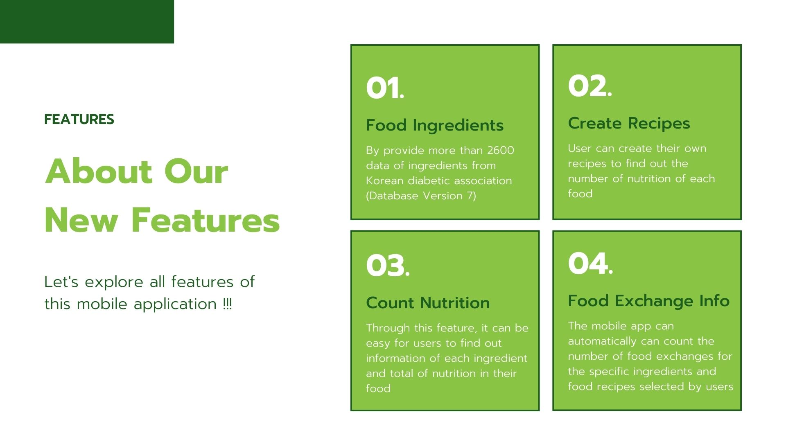
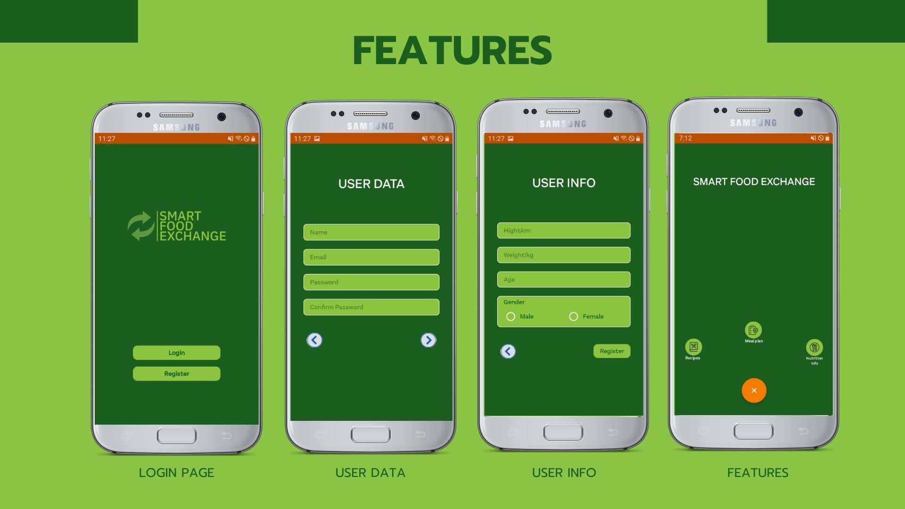
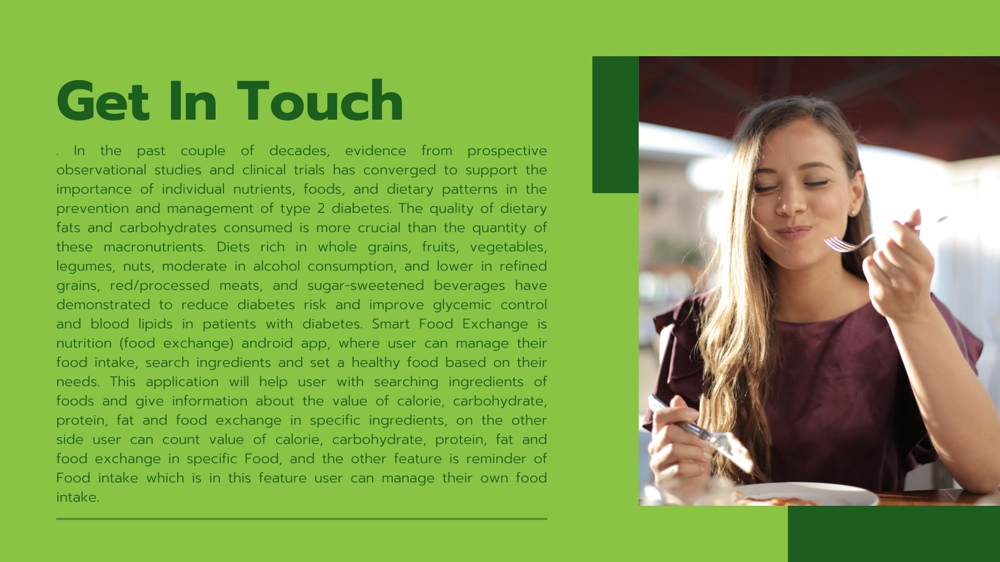
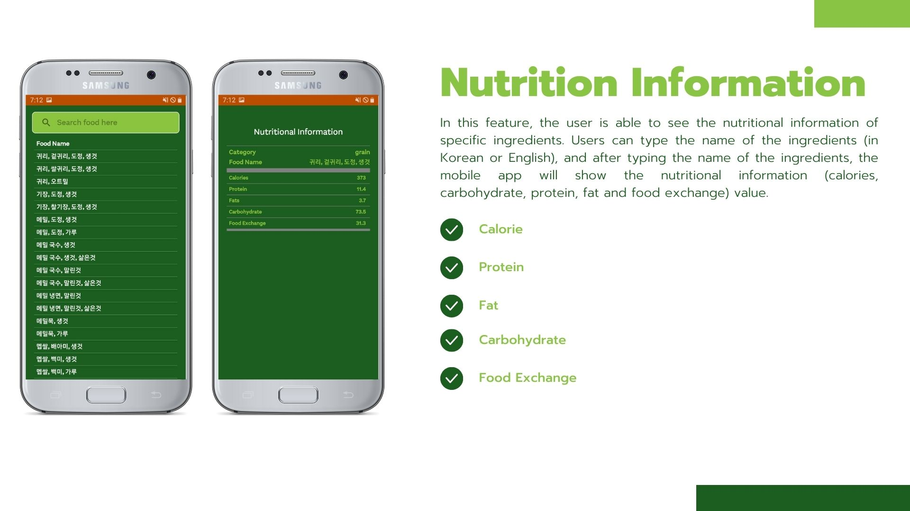
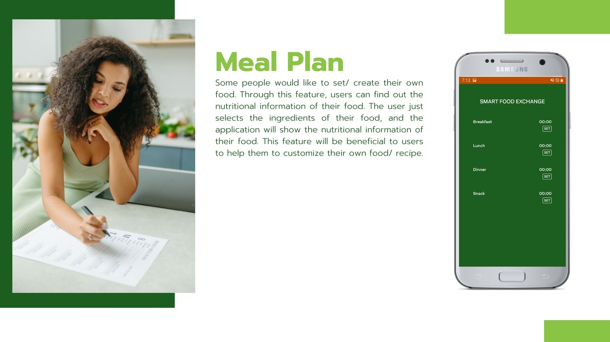
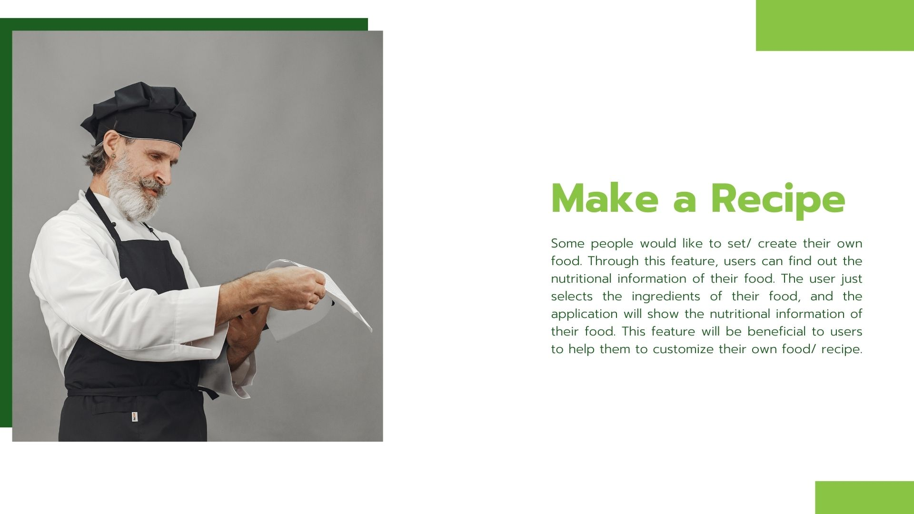
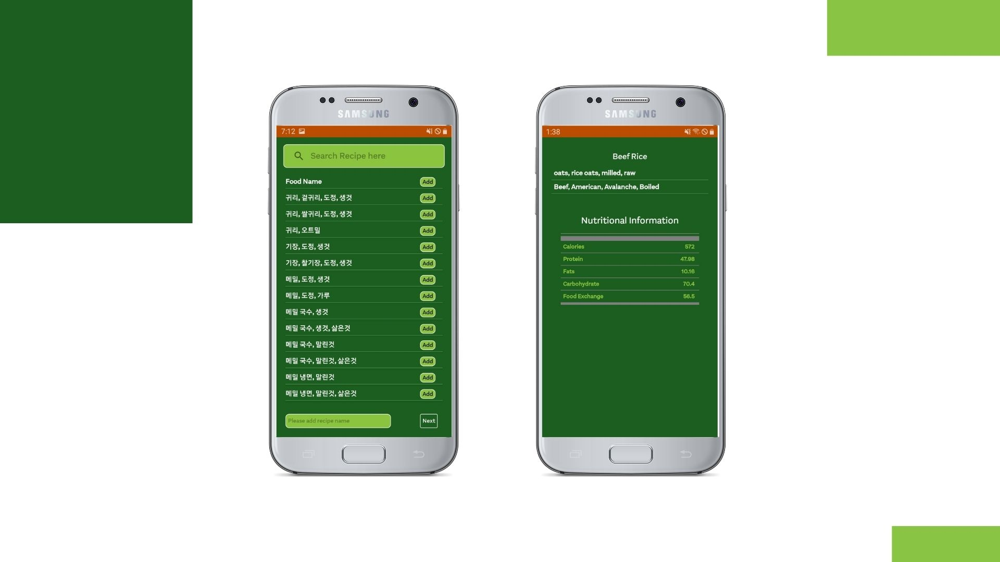

# SmartFoodExchange
## Android Mobile Application
- Assist and help users to find ingredients with a total of items more than 2600, and creates their recipes with nutritional and Food exchange information.
- This app is based on korean foods and food exhnage association. 

# Screenshots

